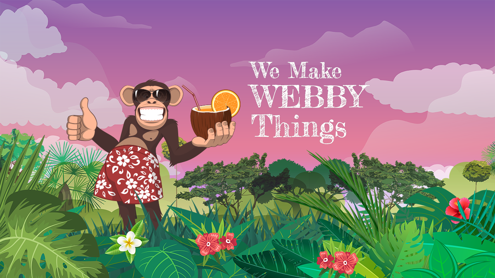

# Primitive One Frontity Theme
A Headless WordPress (REST API) Theme for Frontity

Created with a little Node.js and React magic. 

Built on the awesome new, itty bitty, Frontity framework: https://frontity.org/ 

With little help from our friends: Bootstrap 4, GSAP and ScrollMagic. 

Live demo site: https://primitivedigital.co.uk  

Domain and PHP server provided by: https://primitivehosting.uk/  

N.B. This is only my second React based website.  
It may be messy and it may be downright wrong in places.

## Performance Comparrison Testing (WIP)
I will be creating links to compare the performance of various deployments.  

Now: https://now.primitivedigital.uk  
Google: TBC  
AWS: TBC  
Static: TBC  

## Performance Comparrison Testing (WIP)
1st Draft Release (September 16, 2019):  
- Deployed to Zeit Now with Google analytics  

1st Release (October 01, 2019):  
- Performance enhancements and docs update  

### To Do >>>>>>

1. Amend Nameservers/DNS/Install location
2. Fix: React-bootstrap Tabs aria issue: https://github.com/react-bootstrap/react-bootstrap/pull/4331
3. Add: WP theme support and user configurables
4. Test: title/meta sync / helmet / Yoast SEO??
5. Content: load WP pages and create cpt/acf
6. Add: Widget blocks
7. Merge with Boostrap branding kit.
8. Refine: Animation, use scale and overlap tweens
9. Add: Create/Extend animations to pass user configuration
10. AMP

### To Check / Review ??????
- ACF / Custom post type support
- ACF / Custom taxonomies support

## Created by Primitive Digital
### https://primitivedigital.uk

Setup
-----

The following pre-requisites should be in place for the theme to work:

1. WordPress install of version 5.0 or later
2. Optional but highly recommended
2. If deploying to Now install WordPress to a sub directory e.g. - wp.example.com
2. Posts permalink set set to: Custom Structure e.g. - `/posts/%postname%/`
3. Set homepage to a static page

To be added in next release(s) (WIP)
4. ACF Plugin vs Register custom fields
5. CPT UI Plugin vs Register custom post types
6. ACF Category permalink to be set as: Custom base - `/products/`
7. 

Installing and beginning development
------------------------------------

* Follow the Frontity setup outlined in their Docs *

https://docs.frontity.org/getting-started/quick-start-guide

1. `git clone https://github.com/primitiveshaun/primitiveone`
2. `cd primitiveone`
3. `npm install && npx frontity dev (from the project's root directory)`

** Quick Ref: Commands **

npx frontity dev  

npx frontity build  

Deployment
------------------------------------

npx now
npx now --prod

------------------------------------

The code is opensource so play like you mean business.

Enjoy!

#### Need Support
-------

If you find any problems with this theme, please report an issue at:
(https://github.com/primitiveshaun/primitiveone/issues).

#### Primitive One created by Primitive Digital
##### https://primitivedigital.uk

